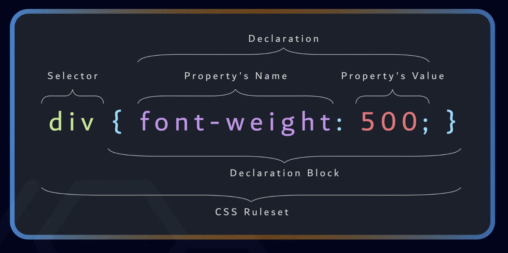

# Intro to Cascading Style Sheets

Cascading Style Sheets (CSS) allows you to create great-looking web pages.

## Table of Contents

- [Anatomy of a Style Rule](#anatomy-of-a-style-rule)
- [CSS Terminology](#css-terminology)
- [Three ways of using CSS](#three-ways-of-using-css)
- [Media queries](#media-queries)
- [Resources](#resources)

## Anatomy of a Style Rule

```css
div {
  font-weight: 500;
  font-size: 16px;
}
```



## CSS Terminology

- `selector`: A selector is a descriptor that lets you target specific elements on the page.
- `property`: Properties in CSS are the attributes you can specify values for, like "color" and "font-size".
- `declaration`: A declaration is a combination of a property and a value.
- `rule/ruleset`: A rule, also known as a style, is a collection of declarations, targeting one or more selectors. A stylesheet is made up of multiple rules.
- `unit`: Some values have units, like px, %, or em. In this case, our padding-top has a value of 24px, which is measured in the "px" unit.

## Three ways of using CSS

There are **three** different ways to apply CSS to an HTML document that you'll commonly come across:

### 1. Inline styles

```html
<h1 style="color: red;">Hello Designers!</h1>
```

### 2. Internal stylesheet

We have a `<style>` tag inside of the `<head>` tag in the `HTML` file.

```html
<html>
  <head>
    <style>
      h1 {
        color: red;
      }
    </style>
  </head>

  <body>
    <h1>Hello Designers!</h1>
  </body>
</html>
```

### 3. External stylesheets

We have the CSS styles in an external `.css` file. We reference that file inside the `<head>` of the `HTML` with a `<link>` tag.
We can reuse one stylesheet in several files.

```css
/* styles.css */

.ingredients-list {
  list-style-type: none;
  padding: 0;
}

.ingredient-item {
  padding: 8px;
}
```
```html
<!-- tiramisu.html -->

<html>
  <head>
    <link rel="stylesheet" href="./styles.css" />
  </head>

  <body>
    <h1>Tiramisu</h1>
    <ul class="ingredients-list">
      <li class="ingredient-item">Egg yolks</li>
      <li class="ingredient-item">Mascarpone</li>
    </ul>
  </body>
</html>
```
```html
<!-- lasagne.html -->

<html>
  <head>
    <link rel="stylesheet" href="./styles.css" />
  </head>

  <body>
    <h1>Lasagne</h1>
    <ul class="ingredients-list">
      <li class="ingredient-item">Pasta</li>
      <li class="ingredient-item">Tomatoes</li>
    </ul>
  </body>
</html>
```

## Media queries

## Resources
- https://systemfontstack.com/
- https://developer.mozilla.org/en-US/docs/Learn_web_development/Core/Styling_basics/Getting_started